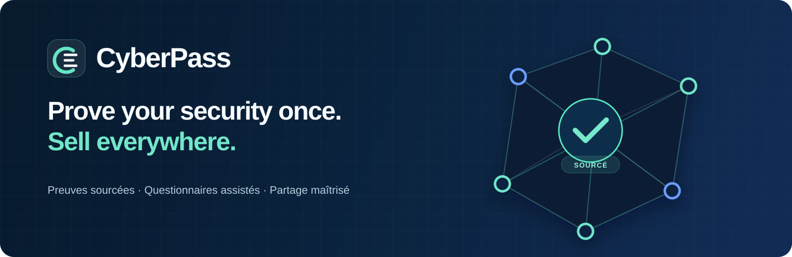
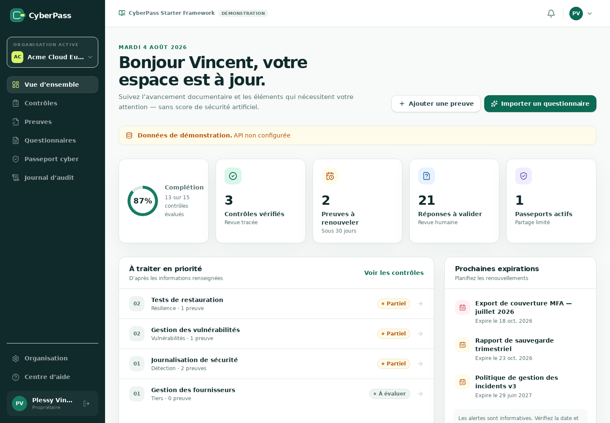
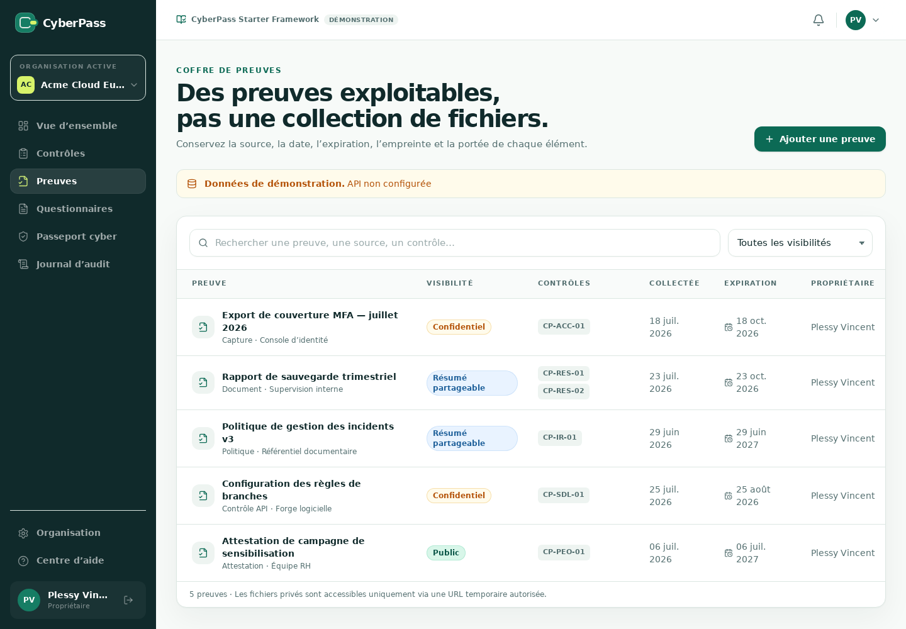
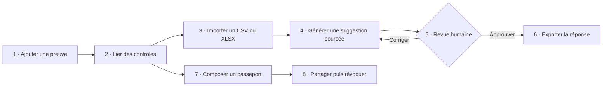
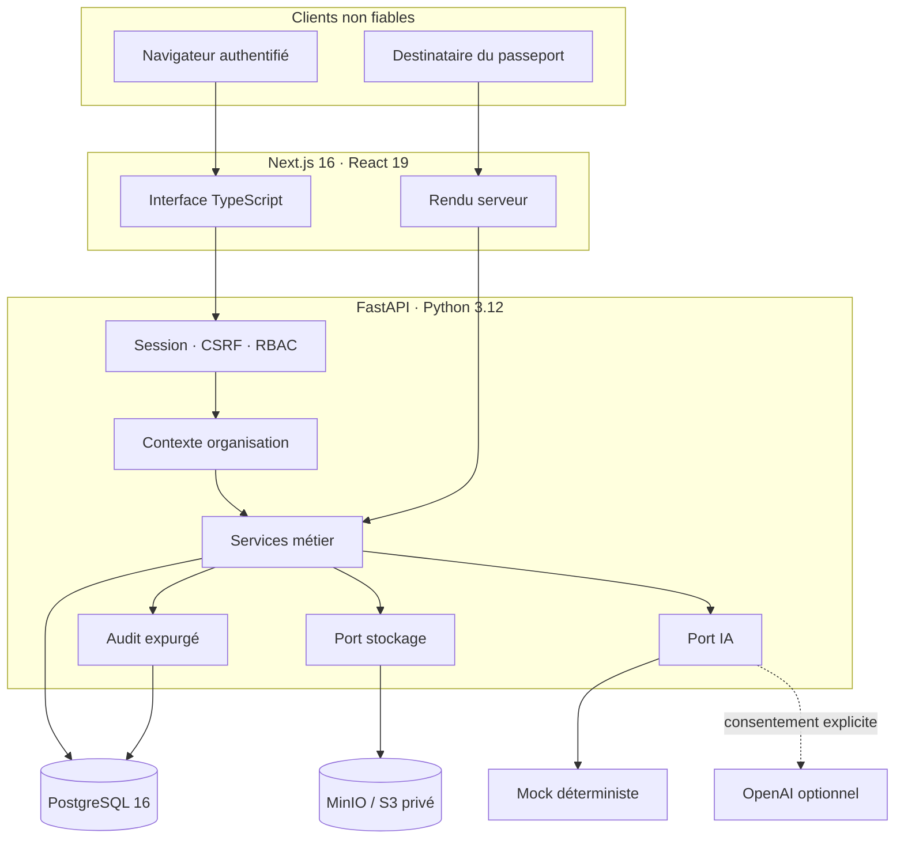

<p align="center">
  
</p>

<p align="center">
  <a href="https://github.com/Vincent-P-essy/CyberPass/actions/workflows/ci.yml"></a>
  
  
  
  
  
</p>

<p align="center">
  <strong>Le dossier de preuves cyber qui transforme une réponse ponctuelle en actif réutilisable.</strong><br />
  Centralisez vos éléments de preuve, préparez les questionnaires avec assistance, imposez une validation humaine et partagez seulement ce qui a été autorisé.
</p>

<p align="center">
  <a href="#démarrage-en-une-commande">Démarrer</a> ·
  <a href="#le-parcours-qui-compte">Parcours produit</a> ·
  <a href="#sécurité-par-conception">Sécurité</a> ·
  <a href="#qualité-et-tests">Tests</a> ·
  <a href="#documentation">Documentation</a>
</p>

---

## Pourquoi CyberPass ?

Les mêmes questions de sécurité reviennent dans chaque appel d’offres, revue fournisseur ou processus d’achat. Les réponses finissent dispersées entre tableurs, documents et messages, sans source claire ni date de validité.

CyberPass organise ce travail autour de quatre objets traçables :

| Besoin | Réponse CyberPass |
|---|---|
| Réutiliser une information sans la déformer | Une preuve datée, versionnée et reliée aux contrôles qu’elle étaye |
| Répondre plus vite sans déléguer la décision | Une suggestion structurée, sourcée, toujours soumise à revue humaine |
| Rassurer sans ouvrir tout le coffre | Un passeport temporaire construit depuis une liste blanche explicite |
| Expliquer qui a fait quoi | Un journal d’audit append-only au niveau applicatif, expurgé des secrets |

> [!IMPORTANT]
> CyberPass est un outil de collecte, de revue et de partage. Il ne délivre aucune certification, ne remplace pas un audit indépendant et ne garantit aucune conformité juridique ou sécurité absolue.

## Ce que contient le MVP

- **Identité et organisations** — inscription, connexion, cookies sécurisés, CSRF double-submit, sélection d’organisation et rôles `OWNER`, `ADMIN`, `ANALYST`, `VIEWER`.
- **Catalogue de contrôles** — 15 contrôles de démonstration, états documentaires explicites, responsable, notes et dates de revue.
- **Coffre de preuves** — métadonnées, confidentialité, contrôles liés, versions, SHA-256, stockage privé local ou S3/MinIO et téléchargement autorisé à durée courte.
- **Questionnaires CSV/XLSX** — aperçu du mapping, import borné, conservation de l’ordre, génération par lots, correction, approbation humaine et export neutralisé contre les formules.
- **Assistance configurable** — fournisseur mock déterministe par défaut ; adaptateur OpenAI optionnel, sans modèle codé en dur et uniquement après consentement explicite par requête.
- **Passeport cyber** — sélection explicite des contrôles et résumés partageables, token opaque stocké sous forme de hash, expiration, révocation et projection publique minimale.
- **Traçabilité** — événements d’authentification et d’actions métier sans mots de passe, cookies, tokens, fichiers ni réponses complètes.
- **Expérience produit** — interface française responsive, états vides, erreurs honnêtes, mode démonstration signalé et parcours clavier cohérent.


## Aperçu





Captures du frontend réellement exécuté avec le mode de démonstration intégré (`apps/web/lib/demo-data.ts`). Les données sont fictives et l’API n’est pas connectée dans ces vues.

## Le parcours qui compte



Une suggestion ne passe jamais automatiquement à l’état approuvé. Les identifiants de preuves et de contrôles proposés sont revalidés dans le tenant actif avant persistance.

## Démarrage en une commande

### Prérequis

- Docker Engine récent avec Docker Compose v2 ;
- `make` ;
- OpenSSL, utilisé uniquement pour générer les secrets locaux ;
- pour les contrôles hors Docker : Node.js 22, npm et Python 3.12.

### Lancer la démonstration complète

```bash
git clone https://github.com/Vincent-P-essy/CyberPass.git
cd CyberPass
make demo
```

`make demo` génère un fichier `.env` local avec des secrets aléatoires, construit les images, applique les migrations et charge un jeu de données entièrement fictif.

Pour installer aussi les outils locaux de lint et de test :

```bash
make install
```

| Service | Adresse |
|---|---|
| Application | <http://localhost:3000> |
| OpenAPI / Swagger | <http://localhost:8000/docs> |
| État API | <http://localhost:8000/health> |
| Console MinIO | <http://localhost:9001> |

Compte propriétaire de démonstration :

```text
E-mail       vincent.plessy@demo.example.com
Mot de passe CyberPass-Demo-2026
```

Le seed affiche également une fois le chemin du passeport public temporaire. Toutes les personnes, organisations, preuves et réponses du jeu de démonstration sont fictives.

### Commandes utiles

```bash
make help       # liste les commandes documentées
make logs       # suit les journaux web et API
make migrate    # applique les migrations Alembic en attente
make seed       # charge ou vérifie le jeu de démonstration idempotent
make test       # tests unitaires et d’acceptation
make lint       # format, lint et typage strict
make test-e2e   # parcours critique dans Chromium
make down       # arrête les services, conserve les volumes
```

## Architecture

CyberPass reste volontairement un monolithe modulaire : deux processus déployables, une base relationnelle et un stockage objet privé. Cette forme garde les transactions et les frontières de confiance lisibles pendant la validation du produit.



### Arborescence

```text
CyberPass/
├── apps/
│   ├── api/                 # FastAPI, SQLAlchemy, Alembic, fournisseurs IA/stockage
│   └── web/                 # Next.js App Router, composants et tests UI/E2E
├── packages/
│   ├── config/              # configuration partagée minimale
│   └── shared-types/        # contrats TypeScript communs
├── infra/                   # initialisation locale et notes de déploiement
├── docs/                    # architecture, sécurité, menaces, backlog, exemples API
├── docker-compose.yml       # PostgreSQL, MinIO, API et web
└── Makefile                 # interface reproductible du projet
```

## Sécurité par conception

La sécurité ne repose jamais sur un bouton masqué dans l’interface.

| Frontière | Contrôles principaux |
|---|---|
| Tenant | `organization_id` obligatoire, adhésion vérifiée côté serveur, requêtes bornées, refus inter-tenant indistinguable d’une absence |
| Session | Argon2, JWT `HS256` avec issuer/audience/expiration, cookie `HttpOnly`, `Secure` hors local, CSRF double-submit, limites IP et identité |
| Fichiers | 10 Mio par défaut, formats autorisés, signatures vérifiées, noms assainis, clés objet opaques, bucket privé, hash SHA-256 |
| XLSX/CSV | limites de décompression/feuilles/lignes/colonnes/cellules, aucune macro exécutée, formules neutralisées à l’export |
| Assistance IA | contexte minimisé, contenu balisé comme non fiable, aucun outil, sortie Pydantic stricte, références revalidées, approbation séparée |
| Passeport | token CSPRNG retourné une fois, hash en base, expiration obligatoire, révocation, DTO public en liste blanche, `no-store` |
| Journalisation | métadonnées bornées, secrets exclus de l’audit, tokens de chemin masqués par l’API ; même redaction exigée à chaque ingress |

Le fournisseur OpenAI s’appuie sur les sorties structurées validées par schéma, selon la [documentation officielle Structured Outputs](https://developers.openai.com/api/docs/guides/structured-outputs). L’activation reste facultative : sans clé et modèle configurés, aucun contenu n’est transmis à un service externe.

Pour le modèle de menace détaillé et les risques résiduels, lire [docs/threat-model.md](docs/threat-model.md) et [docs/security.md](docs/security.md).

## Configuration

La source de vérité locale est `.env`, créé depuis `.env.example`. Ne versionnez jamais ce fichier.

| Variable | Rôle | Valeur locale par défaut |
|---|---|---|
| `APP_ENV` | Profil validé (`development`, `test`, `staging`, `production`) | `development` |
| `DATABASE_URL` | Connexion SQLAlchemy à PostgreSQL | service Compose `postgres` |
| `JWT_SECRET` | Secret de signature, 32 caractères minimum hors test | généré par `make setup` |
| `ACCESS_TOKEN_MINUTES` | Durée de la session | `30` |
| `CORS_ORIGINS` | Origines web exactes autorisées | `http://localhost:3000` |
| `STORAGE_BACKEND` | `local` ou `s3` | `s3` dans Compose |
| `S3_*` | Endpoint, bucket privé, région et identifiants | MinIO local |
| `MAX_UPLOAD_BYTES` | Limite par fichier | `10485760` |
| `OPENAI_API_KEY` | Clé du fournisseur externe optionnel | vide |
| `OPENAI_MODEL` | Modèle choisi par le déployeur | vide |
| `NEXT_PUBLIC_API_URL` | URL API accessible au navigateur | `http://localhost:8000/api/v1` |

En déploiement, le navigateur et l’API doivent partager le même hostname derrière un reverse proxy (par exemple `/api/v1`) afin que les cookies host-only soient disponibles au rendu Next.js. La variante `app.example` + `api.example` n’est pas prise en charge telle quelle.

> [!CAUTION]
> La configuration Compose est destinée au développement. Pour une exposition réelle, placez les secrets dans un gestionnaire dédié, terminez TLS sur un proxy durci, configurez sauvegardes/restauration, chiffrement objet, supervision et limites distribuées.

## Qualité et tests

### Vérification locale

```bash
# Backend
cd apps/api
.venv/bin/ruff check .
.venv/bin/ruff format --check .
.venv/bin/mypy app
.venv/bin/python -m pytest --cov=app --cov-report=term-missing

# Frontend, depuis la racine
npm run lint
npm run typecheck
npm test
npm run build
npm --workspace @cyberpass/web run test:e2e

# Parcours réellement connecté, avec `make demo` déjà démarré
E2E_REAL_API=1 PLAYWRIGHT_BASE_URL=http://localhost:3000 \
  npm --workspace @cyberpass/web run test:e2e -- real-api.spec.ts

# Infrastructure
docker compose config --quiet
```

### Scénarios d’acceptation

| Scénario | Invariant démontré | Couverture automatisée |
|---|---|:---:|
| A — Isolation | Un membre de l’organisation A ne peut ni lire ni muter une ressource de B | ✅ |
| B — Questionnaire | Un XLSX est prévisualisé, importé, suggéré, revu puis exporté dans l’ordre | ✅ |
| C — Révocation | Un passeport valide devient inutilisable immédiatement après révocation | ✅ |
| D — Non-divulgation | Une preuve confidentielle n’apparaît ni dans la projection publique ni dans le contexte externe | ✅ |

La CI GitHub répète recherche de secrets, audits de dépendances, lint, format, typage, tests, build de production, validation Compose et parcours Playwright connecté à la vraie API à chaque push sur `main` et chaque pull request.

## Limites assumées du MVP

Le dépôt préfère une limite visible à une fonction simulée :

- la récupération de mot de passe et l’envoi d’invitations par e-mail ne sont pas activés ;
- aucun antivirus n’analyse encore les pièces déposées ; la validation de type ne remplace pas un scan ;
- l’import PDF/OCR, les macros et les anciens formats Excel ne sont pas pris en charge ;
- le journal est append-only dans l’application, pas immuable au niveau cryptographique ou WORM ;
- les compteurs de débit sont en mémoire et doivent passer à un backend distribué avant montée en charge ;
- le rendu serveur des passeports publics agrège actuellement les lecteurs sous l’adresse du serveur web ; le plafond global protège le MVP, mais un proxy de confiance transmettant l’IP validée ou une lecture directe dédiée est requis avant exposition à fort trafic ;
- les opérations d’import et de génération sont synchrones et bornées ; une file de travaux sera nécessaire à grande échelle ;
- le Compose local utilise le rôle PostgreSQL de bootstrap pour migrations et runtime ; un déploiement réel doit séparer propriétaire de schéma et compte applicatif minimal ;
- un bearer de téléchargement ou de passeport reste transférable jusqu’à son expiration courte ; chaque proxy/CDN doit masquer ces chemins dans ses journaux ;
- aucun catalogue officiel ISO 27001, NIS2 ou ReCyF n’est embarqué sans validation de provenance et de licence ;
- sauvegardes, restauration testée, SSO, KMS, SIEM, facturation et haute disponibilité relèvent des prochains jalons.

Ces éléments sont priorisés dans le [backlog produit et technique](docs/product-backlog.md).

## Documentation

| Document | Contenu |
|---|---|
| [Plan d’implémentation](docs/implementation-plan.md) | jalons, dépendances et critères de sortie |
| [Architecture](docs/architecture.md) | frontières, modèle de domaine, séquences et décisions |
| [Hypothèses](docs/assumptions.md) | choix réversibles et hors-périmètre explicites |
| [Sécurité](docs/security.md) | invariants, configuration, données, IA et exploitation |
| [Modèle de menace](docs/threat-model.md) | actifs, adversaires, scénarios et mitigations |
| [Exemples API](docs/api-examples.md) | authentification, preuves, questionnaires et passeports |
| [Backlog](docs/product-backlog.md) | P0 du vertical slice, P1 production et évolutions |

## Contribuer et signaler une vulnérabilité

Les conventions de développement et la checklist de contribution sont décrites dans [CONTRIBUTING.md](CONTRIBUTING.md). Pour une vulnérabilité, n’ouvrez pas d’issue publique : suivez la procédure de [SECURITY.md](SECURITY.md).

---

<p align="center">
  Conçu et maintenu par <a href="https://github.com/Vincent-P-essy"><strong>Plessy Vincent</strong></a>.
</p>
