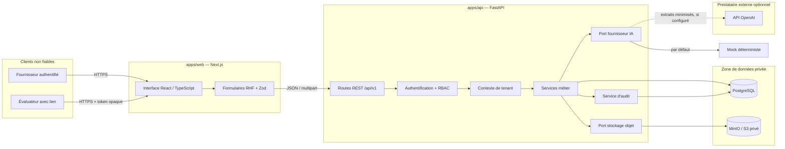
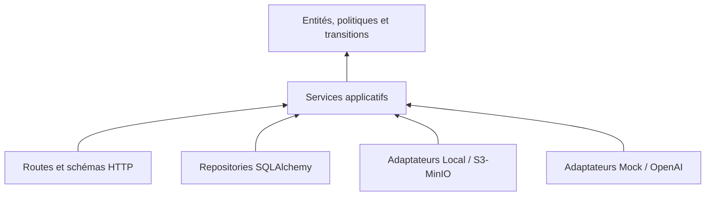
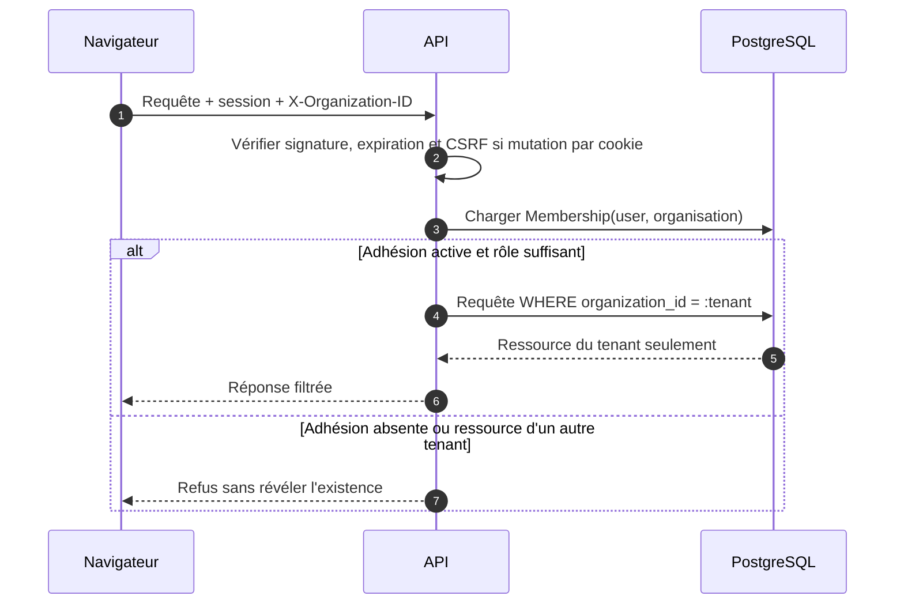
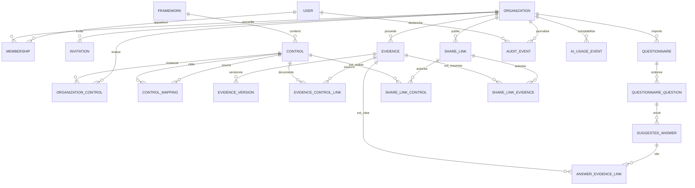
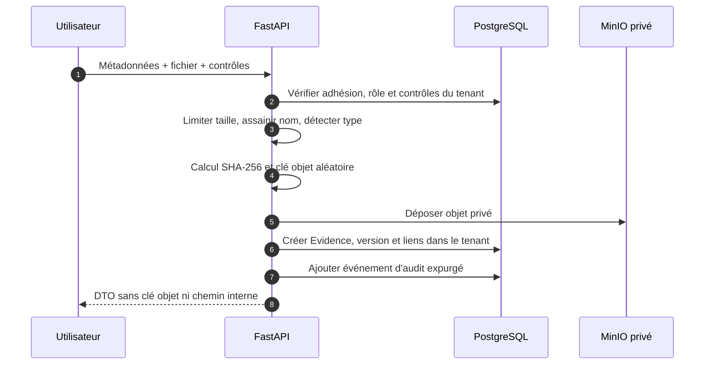
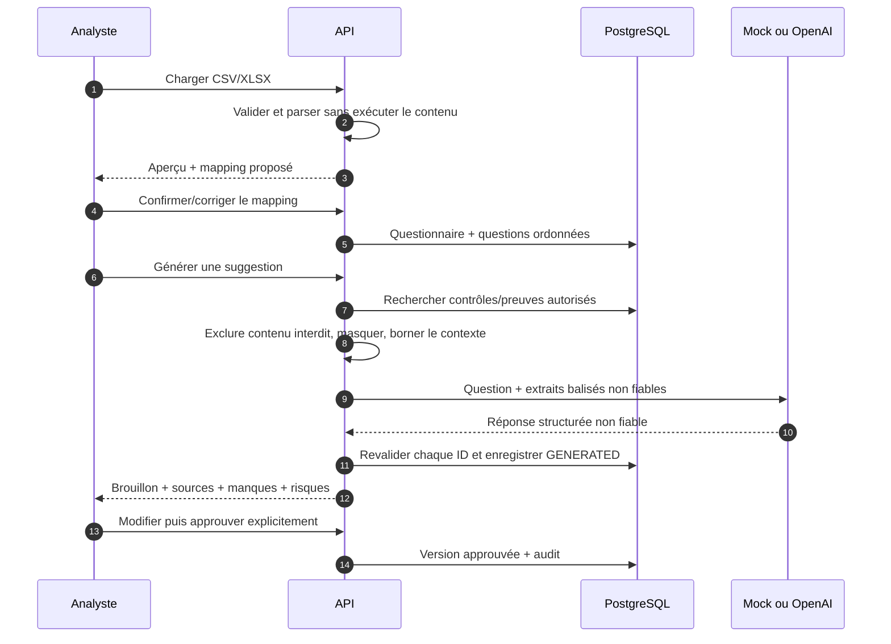
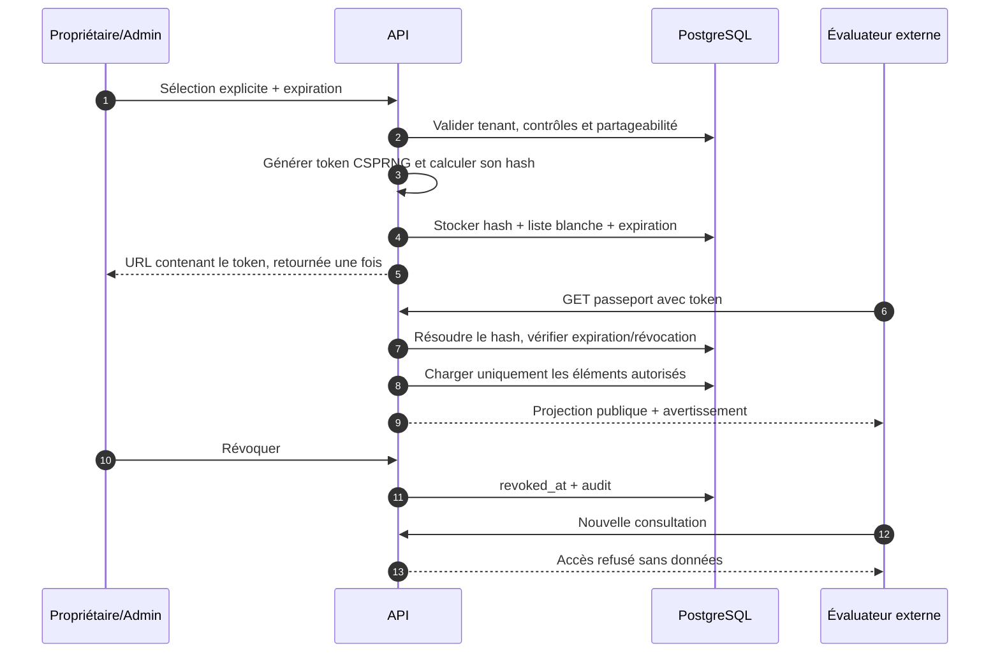
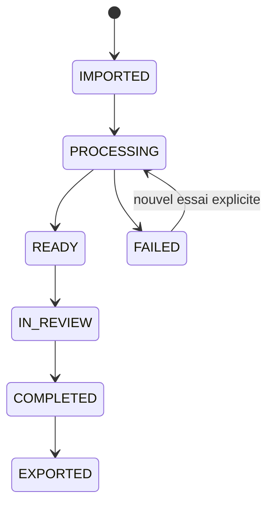
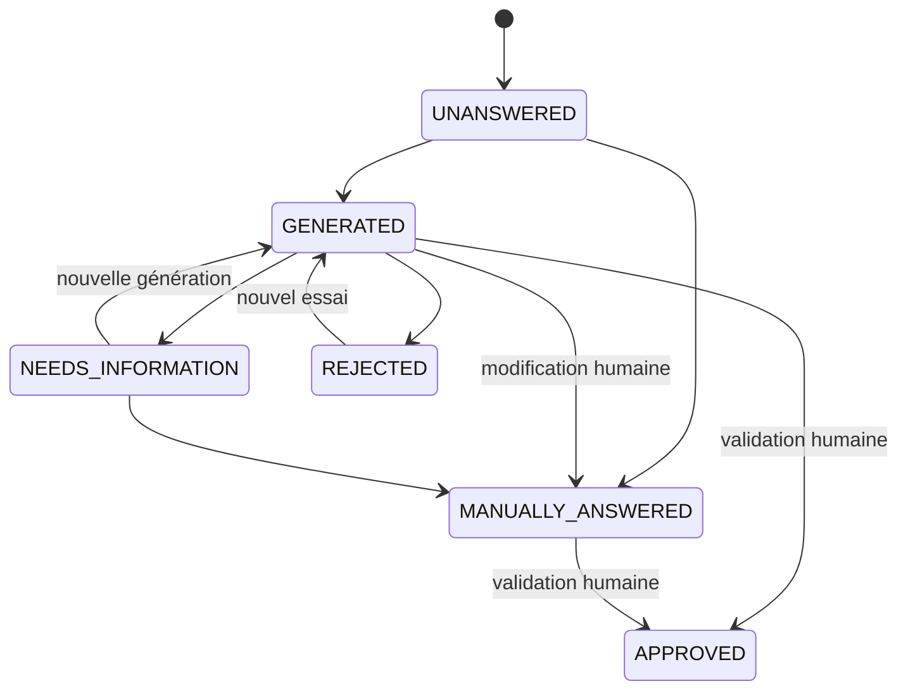
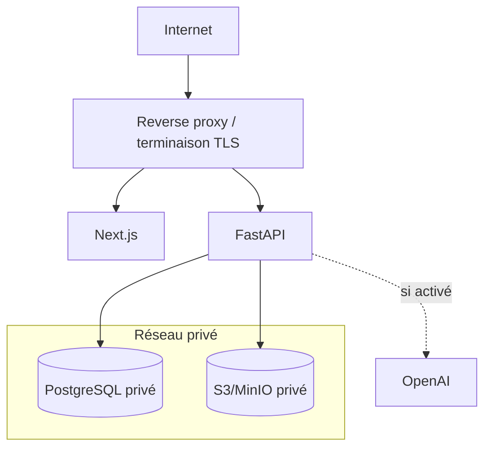

# Architecture de CyberPass

## Portée et statut

Ce document décrit l’architecture du MVP et les invariants à préserver. Le socle vérifié dans le code est Next.js/FastAPI/PostgreSQL, avec adaptateurs de stockage local ou S3/MinIO et fournisseurs IA mock/OpenAI. Le détail des routes doit toujours rester synchronisé avec l’OpenAPI générée par FastAPI : une description architecturale n’est pas une preuve qu’un parcours a passé ses tests.

CyberPass est un SaaS multi-tenant de collecte, revue et partage sélectif de preuves de cybersécurité. Il ne certifie pas les organisations, ne remplace pas un audit et ne garantit aucune conformité juridique.

## Principes structurants

1. **Monolithe modulaire avant microservices.** Une application web et une API déployables séparément, une base relationnelle et un stockage objet.
2. **Tenant obligatoire dans le domaine.** L’organisation active est validée contre les adhésions de l’utilisateur à chaque requête métier.
3. **Autorisation côté serveur.** Les contrôles d’interface améliorent l’ergonomie mais ne sont jamais une frontière de sécurité.
4. **Données privées par défaut.** Le passeport public est une projection en liste blanche, distincte des modèles internes.
5. **IA non souveraine.** Le modèle propose ; le serveur valide les références ; l’humain approuve.
6. **Ports et adaptateurs.** Les fournisseurs d’IA et de stockage sont interchangeables sans modifier les règles métier.
7. **Traçabilité sans surpromesse.** Le journal applicatif est append-only, mais n’est pas présenté comme inviolable ou certifié.

## Vue d’ensemble



### Responsabilités par composant

| Composant | Responsabilité | Ne doit pas faire |
|---|---|---|
| Next.js | Navigation, rendu, accessibilité, validation ergonomique, i18n initiale FR | Décider seul d’une autorisation ou exposer un secret serveur |
| FastAPI routes | Authentifier, valider la requête, appeler un service, sérialiser une réponse bornée | Porter les règles métier ou construire des requêtes SQL ad hoc |
| Services métier | Autorisations fines, transitions d’état, orchestration, audit | Faire confiance à un identifiant ou un rôle envoyé par le client |
| Repositories SQLAlchemy | Requêtes systématiquement bornées par tenant, transactions | Retourner une ressource de tenant sans filtre d’organisation |
| PostgreSQL | Source de vérité relationnelle, contraintes, index, migrations | Stocker les fichiers ou une clé OpenAI |
| Adaptateur stockage | Clés objets générées, hash, écriture/lecture privée, URL temporaires si disponible | Rendre un bucket privé publiquement lisible |
| Fournisseur IA | Produire un objet structuré conforme au contrat | Approuver une réponse ou décider qu’une preuve est autorisée |
| Journal d’audit | Émettre des événements append-only et expurgés | Recevoir mots de passe, tokens, fichiers ou réponses complètes |

## Organisation du monorepo

Structure cible ; l’arborescence exacte doit être alignée sur le dépôt final.

```text
CyberPass/
├── apps/
│   ├── web/                  # Next.js, React, TypeScript, Tailwind
│   └── api/                  # FastAPI, domaine, SQLAlchemy, Alembic
├── packages/
│   ├── shared-types/         # optionnel : contrats générés/partagés
│   └── config/               # conventions frontend communes
├── infra/
│   ├── docker/
│   └── scripts/
├── docs/
├── .github/workflows/
├── docker-compose.yml
├── Makefile
└── .env.example
```

Dans l’API, une dépendance orientée vers le domaine évite que les routes, SQLAlchemy, MinIO ou OpenAI deviennent le centre de l’application :



## Frontière multi-tenant

### Résolution du contexte

Le contrat backend implémenté utilise :

- un JWT signé pour l’identité, transmis en cookie `HttpOnly` pour le navigateur et éventuellement en `Authorization: Bearer` pour un client API ;
- `X-Organization-ID` comme **sélecteur** d’organisation ; cet en-tête n’accorde aucun droit ;
- une vérification serveur de `Membership(user_id, organization_id)` ;
- un repli vers l’unique adhésion uniquement lorsque l’utilisateur n’appartient qu’à une organisation.



### Invariants obligatoires

- Toute table de ressource appartenant à un client porte `organization_id NOT NULL`.
- Toute lecture, modification et suppression métier filtre simultanément l’identifiant public **et** `organization_id`.
- Une ressource d’un autre tenant et une ressource inexistante produisent une réponse indistinguable.
- Les IDs UUID réduisent l’énumération mais ne remplacent jamais le contrôle d’accès.
- Les liens publics ne réutilisent pas le contexte tenant authentifié : ils résolvent un token haché vers une projection préautorisée.
- Les objets MinIO sont liés à une preuve du tenant en base ; une clé objet brute n’est jamais une autorisation.
- Les références renvoyées par le fournisseur IA sont réinterrogées dans le tenant actif avant persistance.
- Les événements d’audit portent le tenant lorsqu’il existe et ne peuvent pas être relus depuis un autre tenant.

Pour renforcer la défense en profondeur après le MVP, PostgreSQL Row-Level Security peut compléter — mais non remplacer — les filtres applicatifs et les tests d’isolation.

## Modèle de domaine cible

Le diagramme montre les agrégats et relations attendus ; types de colonnes, contraintes et noms exacts restent définis par les migrations Alembic.



### Contraintes majeures

- identifiants publics UUID ;
- dates en UTC et `created_at`/`updated_at` cohérents ;
- unicité d’une adhésion par couple utilisateur/organisation ;
- unicité du code d’un contrôle dans son framework ;
- unicité de la position d’une question dans un questionnaire ;
- contrainte de domaine ou enum pour les statuts, rôles, types et confidentialité ;
- liens de preuve, réponse et partage cohérents avec le même tenant, contrôlés par service et testés ;
- index composites commençant par `organization_id` pour les accès fréquents ;
- suppression logique des ressources sensibles lorsque l’historique doit survivre.

## Parcours critiques

### Ingestion d’une preuve



Si l’écriture objet réussit mais que la transaction SQL échoue, le service doit supprimer l’objet orphelin ou le placer dans une routine de réconciliation. Si la base est validée avant l’objet, l’état doit rester non téléchargeable jusqu’à confirmation. Cette compensation est à vérifier dans l’implémentation.

### Import, génération et revue



Le mock déterministe est le fournisseur par défaut sans clé. OpenAI n’est utilisé que si la configuration requise est présente ; le nom du modèle vient de `OPENAI_MODEL`. Une question ou une preuve n’est jamais traitée comme une instruction de niveau système.

### Publication d’un passeport



## États métier

### Contrôles

`NOT_ASSESSED → NOT_IMPLEMENTED | PARTIAL | IMPLEMENTED | VERIFIED | NOT_APPLICABLE`

Les transitions peuvent être révisées ; `VERIFIED` est un état de suivi, pas une certification CyberPass.

### Questionnaires



### Réponses



Aucune transition issue d’une génération ne doit aboutir automatiquement à `APPROVED`.

## Surface API prévue

Préfixe implémenté : `/api/v1`. Les chemins ci-dessous résument la surface vérifiée dans le code ; `/openapi.json` reste la source de vérité exécutable.

| Domaine | Routes conventionnelles |
|---|---|
| Authentification | `/auth/register`, `/auth/login`, `/auth/logout`, `/auth/me` |
| Organisations | `/organizations`, `/organizations/{id}/select` |
| Catalogue | `/frameworks`, `/controls`, `/controls/{id}` |
| Preuves | `/evidences`, `/evidences/{id}`, `/evidences/{id}/download` |
| Questionnaires | `/questionnaires/preview`, `/questionnaires/import`, `/questionnaires/{id}`, `/questionnaires/{id}/generate`, édition/approbation par question et `/questionnaires/{id}/export` |
| Partage | `/share-links`, révocation d’un lien, `/public/passports/{token}` |
| Pilotage | `/dashboard`, `/audit-events` |
| Système, hors préfixe | `/health`, `/ready`, et documentation OpenAPI en environnement non production |

Les exemples exécutables doivent être régénérés ou corrigés à partir du schéma OpenAPI réel ; voir [api-examples.md](./api-examples.md).

## Stockage et cohérence

### PostgreSQL

- transaction par commande métier ;
- contraintes de clé étrangère et d’unicité au-delà de la validation Pydantic ;
- migrations Alembic versionnées, jamais `create_all` comme mécanisme de production ;
- pagination et ordre déterministe pour les listes ;
- verrous ou contrôle optimiste pour éviter l’écrasement d’une revue concurrente.

### MinIO / S3

- adaptateur local utilisé par défaut en développement/tests, adaptateur S3/MinIO configurable à l’exécution ;
- bucket non public ; chiffrement et politique de cycle de vie à configurer en production ;
- clés opaques générées côté serveur ;
- téléchargement autorisé à chaque demande, directement diffusé par l’API ou via URL signée ; durée par défaut vérifiée : 300 secondes ;
- aucun token ou URL signé dans le journal d’audit.

### Redis

Redis reste optionnel dans le MVP. Il devient pertinent lorsque l’import, la génération en lot, les reprises, le rate limiting distribué ou les notifications nécessitent des tâches asynchrones. L’ajouter sans worker, idempotence et observabilité ne crée pas de fiabilité utile.

## Configuration

Les catégories suivantes doivent provenir de variables d’environnement ou d’un gestionnaire de secrets en production :

- URL PostgreSQL et paramètres de pool ;
- secret/signature et durée de session ;
- origine web autorisée et paramètres de cookies ;
- endpoint, région, bucket et identifiants S3/MinIO ;
- fournisseur IA, `OPENAI_API_KEY` et `OPENAI_MODEL` ;
- limites d’upload, URL signées, rate limiting et niveau de log.

Aucune clé réelle n’est fournie dans `.env.example`, la base, le bundle frontend ou les logs.

## Déploiement cible minimal



Le Docker Compose local est un outil de développement, pas une architecture de production durcie. Avant mise en production : sauvegardes et restauration testées, TLS, rotation des secrets, supervision, alerting, scans, politique de rétention, restrictions réseau et procédure d’incident sont nécessaires.

## Décisions différées

- SSO SAML/OIDC, SCIM et invitations avancées ;
- workers et orchestration asynchrone ;
- antivirus effectif et sandbox documentaire ;
- chiffrement applicatif/KMS et stockage régional contractualisé ;
- connecteurs Microsoft 365, GitHub, GitLab et clouds ;
- extraction PDF et OCR ;
- catalogue réglementaire validé ;
- portail acheteur, webhooks, facturation et marque blanche ;
- Row-Level Security PostgreSQL et journal d’audit à immuabilité renforcée.

Les risques et conditions de passage en production sont détaillés dans [security.md](./security.md) et [threat-model.md](./threat-model.md).
