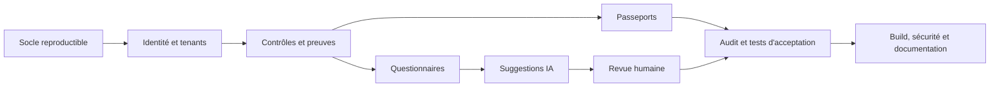

# Plan d’implémentation du MVP CyberPass

## Finalité

Ce plan transforme le cahier des charges en un **vertical slice démontrable de bout en bout** : un fournisseur crée son espace, rattache une preuve à un contrôle, importe un questionnaire, obtient une proposition de réponse sourcée, la valide humainement, puis publie un passeport à durée limitée. L’accès externe ne révèle que les données explicitement partagées et les opérations sensibles sont auditables.

CyberPass facilite la collecte et la présentation de preuves. Le produit **n’est pas un organisme de certification** et ne fournit ni certification, ni garantie de conformité juridique, ni score absolu de sécurité.

## Règles de lecture

Les statuts ci-dessous ne doivent être marqués « terminé » qu’après vérification dans le dépôt et exécution des contrôles associés.

| État | Signification |
|---|---|
| À faire | Aucun résultat vérifié |
| En cours | Code présent mais parcours ou contrôle qualité incomplet |
| Terminé | Implémentation et vérification correspondante effectuées |
| Différé | Hors MVP, consigné dans le backlog |

Le présent document est un plan de livraison, pas une attestation de l’état courant. Les résultats effectifs doivent être consignés dans le rapport de livraison avec les commandes exécutées et leurs sorties.

## Lot 0 — Socle reproductible

**Objectif :** obtenir un monorepo local lançable sans secret réel.

- Initialiser `apps/web` avec Next.js, React, TypeScript strict et Tailwind CSS.
- Initialiser `apps/api` avec FastAPI, Pydantic, SQLAlchemy et Alembic.
- Ajouter PostgreSQL et MinIO dans Docker Compose ; n’ajouter Redis que si une file asynchrone devient nécessaire.
- Fournir `.env.example`, un `Makefile` et des commandes cohérentes de démarrage, migration, seed, lint et test.
- Centraliser la configuration ; refuser au démarrage les secrets faibles ou absents en environnement non local.
- Ajouter les contrôles de qualité : ESLint, Prettier, Ruff, tests, build et workflow CI.

**Critère de sortie :** l’environnement se lance avec la commande documentée, l’API expose sa documentation OpenAPI, le frontend compile et aucune clé réelle n’est versionnée.

## Lot 1 — Identité, organisations et frontière multi-tenant

**Objectif :** rendre impossible l’accès à une ressource d’une autre organisation par simple changement d’identifiant.

- Modéliser `User`, `Organization` et `Membership` avec les rôles `OWNER`, `ADMIN`, `ANALYST`, `VIEWER`.
- Implémenter inscription, connexion et déconnexion ; préparer la récupération de mot de passe et les invitations si elles ne tiennent pas proprement dans le vertical slice.
- Utiliser un contexte d’organisation résolu côté serveur à partir de la session et d’une adhésion active — jamais à partir du seul `organization_id` fourni par le client.
- Appliquer une matrice d’autorisations au niveau service et route.
- Ajouter `organization_id` aux ressources de tenant et des index composites tenant/identifiant.
- Retourner une réponse indistinguable, idéalement `404`, pour une ressource absente ou appartenant à un autre tenant.
- Tester le scénario d’acceptation A avec deux organisations et deux identités distinctes.

**Critère de sortie :** une preuve de l’organisation A ne peut être lue, modifiée, téléchargée ni devinée depuis l’organisation B.

## Lot 2 — Catalogue de démonstration et coffre de preuves

**Objectif :** relier des éléments probants traçables à des contrôles sans revendiquer un référentiel officiel.

- Modéliser `Framework`, `Control`, `ControlMapping`, `OrganizationControl`, `Evidence`, `EvidenceVersion` et `EvidenceControlLink`.
- Fournir le référentiel **CyberPass Starter Framework** d’environ quinze contrôles ; l’identifier explicitement comme un catalogue de démonstration.
- Gérer les statuts de contrôle demandés, sans calculer de faux score de sécurité.
- Valider extension, type MIME détecté, taille et contenu minimal avant stockage.
- Générer la clé objet côté serveur ; assainir le nom d’affichage ; ne jamais réutiliser un chemin client.
- Calculer SHA-256 pendant l’ingestion et conserver les métadonnées de version.
- Garder le bucket privé et fournir des URL signées de courte durée après nouvelle autorisation.
- Réserver un état de quarantaine/scan pour l’intégration antivirus future.
- Vérifier que les niveaux `CONFIDENTIAL` et `RESTRICTED` ne sont jamais exposés par un passeport.

**Critère de sortie :** une preuve peut être ajoutée, associée à un contrôle et téléchargée uniquement par un membre autorisé de son organisation.

## Lot 3 — Import et revue des questionnaires

**Objectif :** convertir un CSV ou XLSX non fiable en questions ordonnées, révisables et exportables.

- Modéliser `Questionnaire`, `QuestionnaireQuestion`, `SuggestedAnswer` et `AnswerEvidenceLink`.
- Parser CSV et XLSX avec limites de taille, nombre de feuilles, lignes, colonnes et longueur de cellule.
- Détecter la feuille et la colonne probables, conserver les colonnes originales et produire un aperçu.
- Permettre à l’utilisateur de corriger le mapping avant validation.
- Préserver l’ordre des questions et tracer les transitions d’état.
- Exporter les réponses dans un format exploitable sans écraser le fichier source.
- Traiter formules, liens, cellules cachées et contenu textuel comme **données non fiables**, jamais comme instructions.

**Critère de sortie :** le scénario d’acceptation B fonctionne sur le fichier de démonstration, y compris modification et approbation humaine.

## Lot 4 — Suggestions assistées par IA

**Objectif :** produire une proposition prudente et sourcée, jamais une décision automatique.

- Définir une interface de fournisseur commune à un mock déterministe et à OpenAI.
- Sélectionner le fournisseur depuis la configuration ; utiliser `OPENAI_MODEL` sans nom de modèle codé en dur.
- Rechercher uniquement des contrôles et preuves du tenant actif.
- Construire un contexte borné, minimisé et balisé comme non fiable.
- Masquer secrets et données sensibles avant tout envoi externe.
- Exiger un consentement explicite avant l’envoi de contenu confidentiel à un fournisseur externe ; le refuser par défaut.
- Valider la sortie structurée côté serveur et rejeter tout identifiant qui ne correspond pas aux ressources autorisées du tenant.
- Enregistrer fournisseur/modèle, horodatage, tokens et coût estimé lorsque disponible, sans clé API ni contenu sensible.
- Forcer `requiresHumanReview=true` et interdire toute transition automatique vers `APPROVED`.
- Retourner explicitement les informations manquantes et drapeaux de risque.

**Critère de sortie :** le produit reste utilisable sans clé OpenAI et aucune suggestion ne peut citer une preuve inexistante ou inter-tenant.

## Lot 5 — Passeport partageable

**Objectif :** fournir une vue publique en liste blanche, limitée dans le temps et révocable.

- Modéliser `ShareLink` et `ShareLinkControl` ; ajouter une table explicite pour les preuves/résumés autorisés si nécessaire.
- Générer un token aléatoire de forte entropie, le remettre une seule fois et ne stocker que son condensat.
- Exiger expiration et sélection explicite des contrôles ; refuser la sélection vide ou hors tenant.
- Reconstruire la projection publique côté serveur à partir d’une liste blanche de champs.
- Exclure fichiers, chemins, notes privées, identités administratives et détails des preuves confidentielles.
- Afficher l’avertissement de non-certification et la date de dernière mise à jour.
- Journaliser création, consultation et révocation sans enregistrer le token brut.
- Tester expiration, révocation, restriction des contrôles et confidentialité.

**Critère de sortie :** les scénarios C et D passent et une URL révoquée ne fournit plus aucune donnée.

## Lot 6 — Audit, tableau de bord et interface

**Objectif :** rendre le parcours compréhensible et les actions importantes traçables.

- Écrire `AuditEvent` via un service append-only ; ne fournir aucune route d’édition/suppression applicative.
- Filtrer IP, user-agent et métadonnées pour éviter secrets, tokens et données métier volumineuses.
- Présenter au tableau de bord : contrôles évalués/vérifiés, preuves expirées, questionnaires en cours, validations en attente, passeports actifs et activité récente.
- Présenter tout indicateur global comme un **taux de complétion**, jamais comme une mesure du niveau de sécurité.
- Ajouter des confirmations avant révocation/suppression et assurer navigation clavier, focus visible, labels et messages d’erreur accessibles.

**Critère de sortie :** les onze catégories d’événements demandées sont couvertes ou leur absence MVP est explicitement documentée.

## Lot 7 — Vérification et livraison

### Tests d’acceptation

| Scénario | Couverture attendue | Condition de réussite |
|---|---|---|
| A — isolation | API/intégration | Aucune existence ni donnée de A révélée à B |
| B — questionnaire | API + parcours critique | Import, suggestion sourcée, édition, approbation et export |
| C — partage | API + Playwright | Liste blanche visible, puis accès refusé après révocation |
| D — confidentialité | API + Playwright | Contrôle visible, fichier et détails confidentiels absents |

### Portes qualité

- migrations sur base vierge puis mise à niveau d’une base existante de test ;
- seed idempotent ou explicitement réinitialisable ;
- lint et typage frontend/backend ;
- tests unitaires et d’intégration ;
- build Next.js de production ;
- démarrage FastAPI et vérification de `/health` ;
- test Playwright du parcours critique ;
- recherche de secrets et vérification de `.env.example` ;
- audit manuel des réponses API publiques et des logs ;
- vérification des en-têtes de sécurité et de la politique CORS.

Les échecs ne doivent pas être masqués : chaque commande, version d’outil, résultat et dérogation doit apparaître dans le rapport de livraison.

## Ordre de livraison recommandé

L’isolation multi-tenant précède toutes les fonctions métier. La génération IA et la publication externe ne sont activées qu’après validation de leurs filtres tenant et confidentialité.

## Points à synchroniser avec l’implémentation

Avant livraison, mettre à jour ces documents avec les choix réels :

- préfixe et noms exacts des routes REST ;
- mécanisme exact de session et protection CSRF ;
- arborescence des modules SQLAlchemy et migrations ;
- limite réelle des fichiers et formats MIME acceptés ;
- durée réelle des URL MinIO et des liens de passeport ;
- stratégie réelle de traitement synchrone ou asynchrone ;
- liste des événements d’audit effectivement émis ;
- commandes de test réellement disponibles et résultats observés.

Ces points ne sont pas implicitement « terminés » du seul fait qu’ils sont décrits ici.
