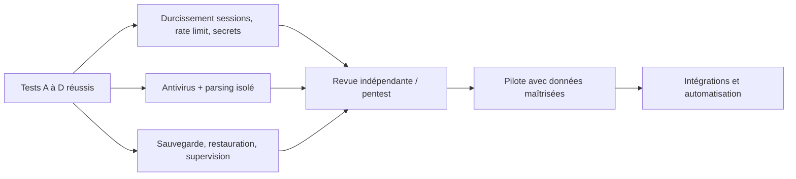

# Backlog produit et technique CyberPass

## Mode d’emploi

Ce backlog sépare le **vertical slice MVP**, les renforcements nécessaires avant production et les évolutions ultérieures. Il ne décrit pas automatiquement l’état du code : une carte n’est terminée que lorsque ses critères d’acceptation sont démontrés par un test ou une vérification reproductible.

### Priorités

| Priorité | Définition |
|---|---|
| P0 | Nécessaire au parcours critique ou à sa frontière de sécurité |
| P1 | Nécessaire avant une mise en production avec de vraies données |
| P2 | Amélioration produit importante après validation du MVP |
| P3 | Extension stratégique, sans dépendance du vertical slice |

### États

`À faire` · `En cours` · `À vérifier` · `Terminé` · `Différé`

Le statut initial de chaque carte est **À vérifier** lorsque l’implémentation peut être en cours dans le dépôt. Ne pas remplacer ce statut sans preuve. Les fonctionnalités hors MVP sont **Différé**.

## Résultat produit recherché

> Prove your security once. Sell everywhere.

Le MVP doit permettre à une entreprise de centraliser des preuves, répondre avec prudence à un questionnaire, faire valider chaque réponse et partager une vue limitée dans le temps. CyberPass ne certifie pas l’entreprise et ne garantit pas sa conformité.

## Epic A — Identité et organisations

### CP-001 — Inscription et connexion sécurisées — P0 — À vérifier

**Valeur :** accéder au produit avec une identité traçable.

**Critères d’acceptation :**

- inscription avec email normalisé et mot de passe validé côté serveur ;
- mot de passe haché avec un algorithme moderne ;
- connexion par cookie `HttpOnly` et/ou Bearer documenté ;
- déconnexion supprimant la session navigateur ;
- erreurs anti-énumération et rate limiting sur les tentatives ;
- événements de connexion sans secret.

### CP-002 — Création et sélection d’organisation — P0 — À vérifier

- un utilisateur crée une organisation et devient `OWNER` ;
- le sélecteur `X-Organization-ID` n’est accepté qu’avec une adhésion valide ;
- le repli automatique n’est permis qu’avec une seule adhésion ;
- la création et la sélection sont testées avec plusieurs organisations.

### CP-003 — RBAC serveur — P0 — À vérifier

- rôles `OWNER`, `ADMIN`, `ANALYST`, `VIEWER` ;
- chaque mutation a une permission explicite ;
- le dernier `OWNER` ne peut être retiré ;
- les accès refusés ne révèlent pas une ressource d’un autre tenant.

### CP-004 — Invitations structurées — P0/P1 — À vérifier

Le cahier des charges accepte une structure prête pour les invitations dans le premier slice.

- MVP minimal : modèle/flux compatible et écran honnête si l’envoi n’est pas disponible ;
- avant production : token hashé à usage unique, expiration, email, acceptation et audit.

### CP-005 — Récupération de mot de passe — P1 — Différé si non livrée

Token à usage unique hashé, expiration courte, invalidation des sessions, réponse anti-énumération, rate limiting et email transactionnel.

## Epic B — Catalogue et contrôles

### CP-010 — CyberPass Starter Framework — P0 — À vérifier

- environ quinze contrôles de démonstration couvrant MFA admin, chiffrement des postes, sauvegardes, restauration, correctifs, vulnérabilités, comptes, logs, incidents, fournisseurs, dépôts, secrets, continuité, sensibilisation et classification ;
- intitulé exact `CyberPass Starter Framework` ;
- aucune présentation comme référentiel officiel NIS2, ReCyF ou ISO 27001 ;
- seed reproductible sans donnée sensible.

### CP-011 — Suivi des contrôles d’organisation — P0 — À vérifier

- statuts demandés de `NOT_ASSESSED` à `NOT_APPLICABLE` ;
- mise à jour réservée aux rôles autorisés et auditée ;
- dates/provenance visibles ;
- aucun faux score global ; seulement un taux de complétion correctement nommé.

### CP-012 — Mappings et import de référentiels — P2 — Différé

- schéma JSON/CSV versionné ;
- validation de licence, provenance et version ;
- aperçu et rapport d’erreurs ;
- `ControlMapping` plusieurs-à-plusieurs avec nature/justification du mapping.

### CP-013 — Catalogue ReCyF/NIS2/ISO validé — P2 — Différé

Travail conditionné à des données vérifiées, une licence compatible et une revue experte. Ne jamais l’annoncer avant cette validation.

## Epic C — Coffre de preuves

### CP-020 — Création d’une preuve et association — P0 — À vérifier

- métadonnées minimales, type, confidentialité, source, collecte et expiration ;
- association à un ou plusieurs contrôles du même tenant ;
- propriétaire, timestamps UTC et audit ;
- validation Pydantic côté serveur.

### CP-021 — Upload privé et intégrité — P0 — À vérifier

- stockage local pour tests/développement et S3/MinIO configurable ;
- bucket non public, clé objet générée, nom assaini ;
- taille/type bornés, SHA-256 en flux ;
- téléchargement temporaire après autorisation ;
- aucune clé objet ou URL signée dans la réponse persistante/logs.

### CP-022 — Versions de preuve — P0 — À vérifier

- `EvidenceVersion` conserve condensat, objet, taille, type et date ;
- remplacer un document ne détruit pas silencieusement la traçabilité ;
- la version courante est déterminée sans ambiguïté ;
- suppression/rétention documentées.

### CP-023 — Expiration et alertes visuelles — P0 — À vérifier

- preuves expirées et bientôt expirées visibles au tableau de bord ;
- une preuve expirée n’est pas présentée comme actuelle par l’IA ou le passeport ;
- seuil « bientôt » configurable ou clairement documenté.

### CP-024 — Antivirus et quarantaine — P1 — Différé

- état de scan, blocage avant téléchargement si nécessaire ;
- intégration ClamAV ou service managé ;
- reprise, mise à jour signatures, métriques et gestion des faux positifs ;
- scan des nouvelles versions et procédure d’incident.

### CP-025 — Chiffrement KMS et clés par environnement — P1/P2 — Différé

Chiffrement serveur S3 immédiatement configurable ; chiffrement applicatif/enveloppe KMS après définition des besoins de recherche, rotation et récupération.

### CP-026 — ACL internes pour preuves restreintes — P1 — Différé

Le MVP sépare strictement les organisations mais ne définit pas de groupes internes par preuve. Avant d’héberger des pièces très sensibles, ajouter une politique explicite pour `RESTRICTED`, des destinataires/groupes, une administration contrôlée et des tests empêchant la lecture par un simple `VIEWER` non autorisé.

## Epic D — Questionnaires

### CP-030 — Aperçu CSV/XLSX — P0 — À vérifier

- détection de feuille et colonne avec score/explication ;
- conservation des colonnes originales ;
- aperçu avant persistance définitive ;
- correction manuelle du mapping ;
- limites de taille, feuilles, lignes, colonnes et cellules.

### CP-031 — Import ordonné et états — P0 — À vérifier

- création de `Questionnaire` et `QuestionnaireQuestion` ;
- ordre stable, source conservée et transitions valides ;
- états `IMPORTED`, `PROCESSING`, `READY`, `IN_REVIEW`, `COMPLETED`, `EXPORTED`, `FAILED` ;
- événements d’import et d’échec expurgés.

### CP-032 — Revue, modification et approbation — P0 — À vérifier

- états de réponse demandés ;
- texte généré modifiable ;
- approbation uniquement via action humaine distincte ;
- acteur/date/version et sources conservés.

### CP-033 — Export exploitable — P0 — À vérifier

- export CSV et/ou XLSX avec question, réponse finale, statut et références utiles ;
- ordre d’origine conservé ;
- neutralisation des formules CSV ;
- pas d’écrasement silencieux du fichier importé.

### CP-034 — Import PDF/OCR — P2 — Différé

Sandbox de parsing, OCR, détection de tableau, limites ressources, aperçu obligatoire et jeu de tests adversariaux avant activation.

## Epic E — Assistance IA

### CP-040 — Port de fournisseur et mock déterministe — P0 — À vérifier

- interface unique ;
- mock par défaut sans clé, stable pour les tests ;
- sortie conforme au schéma demandé ;
- indication claire qu’il s’agit d’une simulation déterministe.

### CP-041 — Fournisseur OpenAI configurable — P0 — À vérifier

- activation uniquement avec configuration valide ;
- modèle fourni par `OPENAI_MODEL`, aucun modèle codé en dur ;
- timeouts/reprises bornés ;
- clé jamais en base, frontend ou logs.

### CP-042 — Recherche tenant et contexte minimisé — P0 — À vérifier

- seules preuves/contrôles du tenant actif ;
- contexte borné par taille et pertinence ;
- dates, expiration et confidentialité intégrées ;
- contenus confidentiels exclus sans consentement explicite.

### CP-043 — Défense prompt injection et validation de sortie — P0 — À vérifier

- contenu importé balisé non fiable ;
- aucune capacité d’outil/navigation ;
- redaction des secrets ;
- JSON validé, IDs réconciliés en base/tenant ;
- informations insuffisantes et risques signalés ;
- aucune preuve/certification inventée.

### CP-044 — Revue humaine obligatoire — P0 — À vérifier

- `requiresHumanReview` forcé côté serveur ;
- génération et approbation sont deux actions/routes distinctes ;
- aucun seuil de confiance n’approuve automatiquement ;
- audit de la génération et de l’approbation.

### CP-045 — Mesure des usages — P0/P1 — À vérifier

- fournisseur, modèle, date, tokens et coût estimé si disponibles ;
- aucun prompt, réponse sensible ou clé dans `AiUsageEvent` ;
- limites et budgets par tenant avant production.

### CP-046 — Évaluations adversariales IA — P1 — Différé

Corpus de prompt injections directes/indirectes, multilingues, IDs inventés, preuves contradictoires/expirées et tests de fuite inter-tenant à exécuter à chaque changement de modèle/prompt.

### CP-047 — Contrat structuré et fraîcheur des preuves — P0 — À vérifier

- valider strictement chaque champ de sortie, y compris types, longueurs, listes et champs supplémentaires ;
- confirmer la capacité structurée réellement utilisée par la version du SDK OpenAI ;
- transmettre ou appliquer côté serveur collecte/expiration et signaler toute preuve périmée ;
- tester JSON incomplet, types inattendus, IDs inventés et preuve expirée.

## Epic F — Passeport cyber

### CP-050 — Création d’un lien à durée limitée — P0 — À vérifier

- sélection explicite des contrôles ;
- token CSPRNG de forte entropie, hash seul en base ;
- expiration obligatoire ;
- URL brute remise sans être journalisée.

### CP-051 — Projection publique en liste blanche — P0 — À vérifier

- identité autorisée, dates, contrôles et résumés explicitement partagés ;
- avertissement de non-certification ;
- absence des fichiers, tokens, chemins, comptes admin et détails sensibles ;
- aucun chargement de ressources tierces recevant le token.

### CP-052 — Révocation et consultation auditée — P0 — À vérifier

- révocation immédiate ;
- lien expiré/révoqué ne renvoie aucune donnée ;
- consultation auditée sans token brut ;
- `Cache-Control: no-store` et `Referrer-Policy: no-referrer`.

### CP-053 — Confidentialité de preuve — P0 — À vérifier

Le scénario D doit prouver qu’une preuve `CONFIDENTIAL` liée à un contrôle partagé n’expose ni fichier, ni détails privés, ni URL.

### CP-054 — Protection secondaire du partage — P2 — Différé

Mot de passe/OTP, destinataire nommé, notification d’accès, filigrane et historique des destinataires. Ces mesures limitent le transfert mais n’empêchent pas une capture d’écran.

### CP-055 — Signatures cryptographiques avancées — P3 — Différé

Définir précisément ce qui est signé, par qui, avec quelle identité et quelle politique de révocation. Ne pas confondre hash SHA-256 d’un fichier et signature d’un organisme.

## Epic G — Audit et pilotage

### CP-060 — Journal d’audit append-only applicatif — P0 — À vérifier

- événements minimaux exigés ;
- tenant, acteur, action, ressource, UTC, IP/user-agent disponibles ;
- métadonnées bornées et expurgées ;
- aucune route update/delete ;
- écriture atomique avec l’action lorsque possible.

### CP-061 — Tableau de bord factuel — P0 — À vérifier

- contrôles évalués/vérifiés ;
- preuves expirées/bientôt expirées ;
- questionnaires en cours, validations requises, passeports actifs ;
- activités récentes ;
- indicateur global nommé « taux de complétion », jamais « score de sécurité ».

### CP-062 — Audit renforcé / export SIEM — P1/P2 — Différé

Export WORM, chaîne de hash/signature, rétention, alertes d’anomalies et accès en lecture seule. Ne pas annoncer une immuabilité forte avant mise en place.

### CP-063 — Notifications d’expiration — P2 — Différé

Préférences, seuils, anti-spam, email, retry/idempotence et audit sans fuite de contenu.

## Epic H — Qualité, sécurité et exploitation

### CP-070 — Tests d’acceptation A à D — P0 — À vérifier

- A : isolation de deux tenants sans révélation d’existence ;
- B : import, suggestion avec preuve existante, édition, approbation, export ;
- C : liste blanche publique puis révocation ;
- D : preuve confidentielle jamais exposée.

### CP-071 — Parcours critique Playwright — P0 — À vérifier

Création/connexion, organisation, preuve, questionnaire, suggestion mock, approbation, partage, consultation et révocation, avec artefacts seulement en cas d’échec et sans secret.

### CP-072 — CI de qualité — P0 — À vérifier

- backend : Ruff, pytest, migration ; mypy si intégré proprement ;
- frontend : ESLint, format, tests pertinents, build TypeScript ;
- Playwright sur environnement reproductible ;
- aucun échec masqué ou étape marquée permissive sans justification.

### CP-073 — Durcissement avant production — P1 — Différé

TLS/HSTS, secrets managés et rotation, moindre privilège, réseau privé, images non-root, CSP/CORS, rate limiting partagé, antivirus, sauvegardes/restaurations, supervision et runbooks.

### CP-074 — Tests de sécurité et pentest — P1 — Différé

Revue indépendante ciblant IDOR, sessions/CSRF, upload/parsing, passeports, logs/secrets et IA. Corriger les constats critiques/élevés avant données réelles.

### CP-075 — Gouvernance des données — P1 — Différé

Rétention, purge, export, sauvegarde, localisation, sous-traitants, droits RGPD, accord de traitement, procédure d’incident et politique de contenu IA.

## Epic I — Intégrations et expansion

| Carte | Fonctionnalité | Priorité | État | Prérequis principal |
|---|---|---:|---|---|
| CP-080 | Microsoft 365 | P2 | Différé | OAuth chiffré, scopes minimaux, renouvellement |
| CP-081 | GitHub | P2 | Différé | App GitHub, webhooks, mapping de preuves |
| CP-082 | GitLab | P2 | Différé | OAuth/token chiffré, instances privées |
| CP-083 | AWS, Azure, OVHcloud | P2 | Différé | Connecteurs par permissions lecture seule |
| CP-084 | Synchronisation automatique | P2 | Différé | Workers, idempotence, reprise, provenance |
| CP-085 | Webhooks sortants | P2 | Différé | Signature, SSRF/egress, retry, journal |
| CP-086 | SSO SAML/OIDC | P2 | Différé | Domaines, linking de comptes, secours admin |
| CP-087 | SCIM | P3 | Différé | SSO, cycle de vie et conflits de rôles |
| CP-088 | Portail acheteur multi-fournisseurs | P3 | Différé | Modèle de consentement et partage nominatif |
| CP-089 | Facturation | P3 | Différé | Entitlements, quotas, fiscalité, webhooks sûrs |
| CP-090 | Marque blanche cabinets cyber | P3 | Différé | Séparation branding/tenant et domaines custom |

## Limitations MVP à afficher honnêtement

- framework de démonstration, sans catalogue réglementaire officiel validé ;
- suggestions pouvant être inexactes et toujours soumises à validation humaine ;
- mock déterministe sans clé OpenAI, qui ne représente pas la qualité d’un modèle réel ;
- pas d’antivirus effectif tant que CP-024 n’est pas livré ;
- pas d’ACL interne preuve par preuve : l’adhésion au tenant et le rôle général constituent la frontière du MVP ;
- pas de PDF/OCR ;
- liens par possession transférables par leur destinataire ;
- audit append-only applicatif, non inviolable face à un administrateur de base ;
- pas de SSO/SCIM, intégrations automatiques, facturation ou marque blanche ;
- Docker Compose local non représentatif d’un déploiement de production durci ;
- hash SHA-256 utile à l’intégrité, mais ne prouvant ni l’auteur ni l’authenticité.

## Ordonnancement recommandé après le vertical slice

### Trois prochaines tâches recommandées

1. **Prouver les frontières** : automatiser les scénarios A à D et la matrice RBAC sur toutes les routes réelles.
2. **Fermer le risque fichier** : intégrer quarantaine/antivirus et isoler le parsing XLSX avec quotas avant usage de documents réels.
3. **Préparer l’exploitation** : révocation/rotation de session, rate limiting distribué, sauvegarde-restauration et revue indépendante ciblée.
