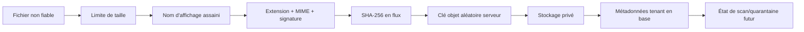
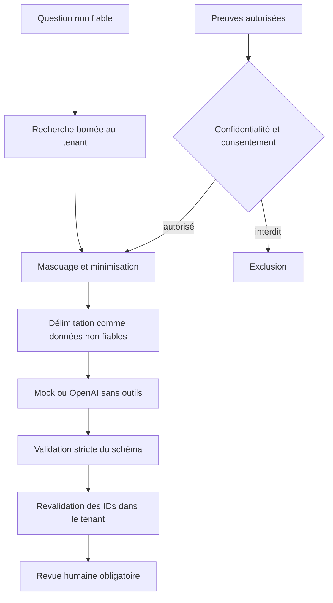

# Sécurité du MVP CyberPass

## Positionnement

Ce document fixe les exigences de sécurité de conception et les vérifications attendues. Il ne constitue ni un audit indépendant, ni une certification, ni une garantie d’absence de vulnérabilité. Une mesure décrite n’est considérée effective qu’après confirmation dans le code, la configuration déployée et les tests.

Le principe directeur est : **privé par défaut, autorisé explicitement, minimisé avant partage**.

## Objectifs de sécurité

1. empêcher qu’un utilisateur accède aux données d’une autre organisation ;
2. empêcher qu’un évaluateur externe voie davantage que la liste blanche de son passeport ;
3. protéger les fichiers, mots de passe, sessions, clés et liens de partage ;
4. empêcher un document importé d’influencer les instructions de l’application ou de provoquer une exécution ;
5. conserver une piste d’audit utile sans recopier les secrets ni les contenus sensibles ;
6. limiter les effets d’une compromission d’un composant ou d’un prestataire externe ;
7. présenter honnêtement les statuts, sources, dates et limites des preuves.

## Invariants non négociables

- `organization_id` est une frontière de sécurité, pas un filtre d’interface.
- Le serveur vérifie l’adhésion et le rôle pour chaque opération métier.
- Une entrée UUID, un en-tête `X-Organization-ID` ou une référence produite par l’IA ne confère aucun droit.
- Les buckets de preuves restent privés ; une URL signée ne précède jamais une autorisation.
- Le contenu d’un fichier, d’une cellule, d’une question ou d’un lien est non fiable.
- Une réponse générée nécessite toujours une revue humaine.
- Un passeport n’expose que des champs explicitement sélectionnés et sérialisés.
- L’application masque les tokens de partage dans ses journaux d’accès connus et exclut cookies, secrets et URL signées de l’audit ; chaque proxy, CDN et collecteur en amont doit appliquer la même règle.
- `VERIFIED` décrit un état interne traçable ; il ne signifie pas que CyberPass certifie l’organisation.

## Authentification et sessions

### Contrat MVP

L’API utilise un JWT signé HS256 pour représenter la session. Pour le navigateur, le jeton est placé dans `cyberpass_access`, cookie `HttpOnly`; le mode `Authorization: Bearer` est aussi accepté. `cyberpass_csrf` porte la valeur double-submit et `cyberpass_organization` mémorise le contexte d’organisation. Les durées et attributs restent configurables par environnement.

Mesures requises :

- mots de passe hachés avec Argon2id ou un algorithme moderne équivalent, avec sel automatique et paramètres documentés ;
- comparaison en temps constant assurée par la bibliothèque ;
- cookie `Secure` hors développement local, `HttpOnly`, `SameSite=Lax` ou `Strict`, chemin et domaine minimaux ;
- durée de session limitée, validation stricte de `iss`, `aud`, `exp`, `nbf` si ces claims sont utilisés ;
- secret HS256 aléatoire, long, distinct par environnement et renouvelable ;
- refus des algorithmes JWT inattendus ; ne jamais accepter `alg=none` ;
- déconnexion invalidant le cookie ; pour une révocation immédiate globale, ajouter rotation/version de session ou liste de révocation ;
- messages de connexion neutres afin de ne pas confirmer l’existence d’un compte ;
- rate limiting local par IP et compte avec `Retry-After` ; un backend distribué, une télémétrie expurgée et un backoff progressif restent requis avant production ;
- aucune persistance du token dans `localStorage` pour le parcours navigateur.

### CSRF

Toute mutation authentifiée par cookie applique le mécanisme double-submit : cookie CSRF lisible par le frontend et valeur correspondante dans `X-CSRF-Token`, comparés côté serveur. Une requête Bearer sans cookie n’utilise pas le même modèle CSRF mais reste soumise à CORS, validation et autorisation. Le contrôle explicite `Origin`/`Referer` n’est pas encore une deuxième barrière dans le MVP et doit être ajouté avant un déploiement exposé.

Le token CSRF n’est pas un secret d’authentification. Il ne remplace ni `SameSite`, ni le contrôle d’origine, ni l’autorisation métier.

### Récupération et invitation

Si ces fonctions sont livrées : token à usage unique, aléatoire, hashé en base, expiration courte, invalidation après usage, réponse anti-énumération et rate limiting. Sinon, elles doivent rester explicitement marquées hors MVP plutôt qu’être simulées.

## Autorisation et isolation des organisations

### Résolution du tenant

`X-Organization-ID` est traité comme une préférence de contexte. L’API doit :

1. authentifier l’utilisateur ;
2. valider le format UUID ;
3. charger une `Membership` active pour ce couple utilisateur/organisation ;
4. établir le rôle côté serveur ;
5. transmettre un objet `TenantContext` aux services/repositories ;
6. filtrer toutes les opérations SQL par ce tenant ;
7. rendre les refus inter-tenant indistinguables d’une absence.

Le repli automatique n’est acceptable que si l’utilisateur possède exactement une adhésion active. Aucune « organisation par défaut » fournie par le client ne peut contourner cette règle.

### Matrice minimale de rôles

Matrice de conception à synchroniser route par route :

| Capacité | OWNER | ADMIN | ANALYST | VIEWER |
|---|:---:|:---:|:---:|:---:|
| Lire le tableau de bord et les contrôles | Oui | Oui | Oui | Oui |
| Modifier un statut de contrôle | Oui | Oui | Oui | Non |
| Ajouter/modifier une preuve | Oui | Oui | Oui | Non |
| Télécharger une preuve interne autorisée | Oui | Oui | Oui | Oui dans le MVP |
| Importer/revoir un questionnaire | Oui | Oui | Oui | Non |
| Approuver une réponse | Oui | Oui | Oui | Non |
| Créer/révoquer un passeport | Oui | Oui | Non par défaut | Non |
| Gérer les rôles | Oui | Non par défaut | Non | Non |
| Supprimer l’organisation | Oui, confirmation forte | Non | Non | Non |

Règles supplémentaires : empêcher la rétrogradation du dernier `OWNER`, interdire l’auto-promotion, vérifier que tous les identifiants liés appartiennent au même tenant et tester les accès directs par URL/API. Le MVP ne définit pas encore d’ACL interne preuve par preuve : un `VIEWER` du tenant peut consulter/télécharger les preuves internes. Si `RESTRICTED` doit limiter aussi des membres de la même organisation, une permission dédiée est nécessaire avant données réelles.

### Défense SQL

- SQLAlchemy avec paramètres liés ; aucune concaténation de texte utilisateur dans du SQL ;
- filtres de tenant encapsulés dans les repositories/services, pas répétés au hasard dans l’interface ;
- transactions atomiques pour toute transition comportant données et audit ;
- contraintes de base pour clés étrangères, unicités et domaines ;
- compte PostgreSQL de l’application sans privilège de superutilisateur ;
- Row-Level Security à étudier comme défense en profondeur après stabilisation.

## Sécurité des preuves et fichiers

### Chaîne d’ingestion

Contrôles requis :

- liste blanche de formats nécessaires au MVP ; rejeter exécutables, archives imbriquées et formats à macros si non indispensables ;
- limites sur octets, nom, pages/feuilles, lignes, colonnes et longueur de cellule ;
- lecture en flux quand possible pour limiter mémoire et déni de service ;
- nom original conservé uniquement comme affichage assaini ; jamais comme chemin ;
- clé objet opaque générée par CSPRNG/UUID côté serveur ;
- vérification du type à partir du contenu lorsque possible, sans faire confiance à `Content-Type` ;
- SHA-256 calculé sur les octets reçus et conservé avec la version ;
- bucket sans accès anonyme et identifiants MinIO/S3 uniquement côté API ;
- chiffrement au repos configuré sur le stockage de production ;
- aucune prévisualisation HTML active d’un fichier non fiable dans l’origine principale ;
- réponse de téléchargement avec type sûr, `Content-Disposition: attachment` et nom encodé ;
- préparation d’un état de quarantaine, mais **aucune affirmation de scan antivirus tant que le moteur n’est pas intégré**.

### Téléchargement

L’émission d’un lien de téléchargement réévalue session, tenant, rôle, existence logique et état du fichier. Le lien signé ou JWT court devient ensuite un bearer transférable jusqu’à son expiration ; la route de récupération revalide l’objet et son tenant, pas la session initiale. Il n’est jamais stocké et n’est généré qu’après autorisation. Les réponses persistantes ne révèlent ni bucket, ni clé objet, ni chemin interne.

### Confidentialité

| Niveau | Usage interne | Partage par passeport |
|---|---|---|
| `PUBLIC` | Membres autorisés | Métadonnées/résumé explicitement sélectionnés ; fichier seulement si une politique dédiée l’autorise |
| `SHARED_SUMMARY` | Membres autorisés | Résumé public dédié et explicitement sélectionné, pas le document source |
| `CONFIDENTIAL` | Membres autorisés selon rôle | Ni fichier ni détail confidentiel ; pas d’envoi externe sans consentement |
| `RESTRICTED` | Accès interne le plus limité | Jamais exposé dans le MVP ; pas d’envoi externe |

La politique exacte doit être codée par liste blanche et couverte par le scénario d’acceptation D.

## Import sécurisé des questionnaires

CSV et XLSX sont des conteneurs de données non fiables :

- ne jamais exécuter macros, formules, scripts, liens ou contenus embarqués ;
- charger XLSX en mode valeurs/données, avec limites de décompression pour réduire les zip bombs ;
- rejeter classeurs chiffrés, corrompus, démesurés ou formats non pris en charge ;
- neutraliser les cellules commençant par `=`, `+`, `-` ou `@` lors d’un export CSV afin d’éviter l’injection de formule ;
- empêcher tout accès fichier/réseau indirect par la bibliothèque de parsing ;
- borner le nombre de feuilles, lignes, colonnes et caractères ;
- conserver les colonnes originales sous forme de données, pas de HTML ;
- échapper le rendu React et interdire `dangerouslySetInnerHTML` pour ce contenu ;
- ne jamais utiliser une URL ou un chemin fourni par le classeur pour effectuer une requête serveur.

Le support PDF/OCR reste hors MVP tant qu’une sandbox, des limites et une stratégie de contenu actif ne sont pas définies.

## Sécurité de la génération IA

### Modèle de confiance

La question, les cellules importées, les descriptions et contenus des preuves sont **hostiles par défaut**. Le fournisseur d’IA est un composant probabiliste externe, pas un moteur d’autorisation ni une base factuelle.

### Défenses contre la prompt injection

- instructions système immuables : ignorer toute instruction trouvée dans le contenu importé ;
- délimiteurs et balises explicites séparant politique, question et extraits ;
- aucun outil, navigateur, shell, URL fetch ou action métier accessible au modèle ;
- contexte limité aux extraits nécessaires, sans document complet par défaut ;
- suppression/masquage des clés, tokens, mots de passe, identifiants sensibles et données personnelles inutiles ;
- exclusion par défaut de `CONFIDENTIAL` et `RESTRICTED` vers OpenAI ; consentement explicite, contextualisé et auditable si une exception est réellement implémentée ;
- sortie JSON validée par Pydantic, longueur bornée et champs supplémentaires refusés ;
- `evidenceIds` et `controlIds` considérés comme non fiables puis revalidés dans PostgreSQL ;
- réponse prudente lorsque la preuve est absente, expirée ou contradictoire ;
- interdiction d’inventer une certification, une preuve ou une conformité ;
- `requiresHumanReview` forcé à `true` côté serveur, indépendamment de la sortie modèle ;
- approbation dans une requête humaine séparée et auditée ;
- tests avec injections directes/indirectes en français et en anglais.

Ces mesures réduisent le risque mais ne rendent pas la prompt injection « résolue ». Les sorties restent à relire.

### Données, coûts et clés

- `OPENAI_API_KEY` dans l’environnement/gestionnaire de secrets, jamais en base, frontend ou logs ;
- `OPENAI_MODEL` obligatoire quand OpenAI est activé, sans modèle codé en dur ;
- timeouts, reprises bornées, limites de tokens et de concurrence ;
- journaliser fournisseur, modèle, tokens et coût estimé quand disponibles, sans prompt complet ni réponse sensible ;
- documenter la région, la rétention et les conditions contractuelles du prestataire avant production ;
- offrir le mock déterministe sans transfert externe et clairement signaler son usage.

## Liens de passeport

### Cycle de vie du token

- générer au moins 128 bits d’entropie via CSPRNG ;
- transmettre le token brut une seule fois au créateur ;
- stocker un hash unidirectionnel, pas le token ;
- associer expiration obligatoire, `revoked_at`, tenant créateur et liste blanche ;
- comparer le hash en temps constant lorsque pertinent ;
- limiter les tentatives et les consultations anormales ;
- répondre sans données après expiration/révocation ;
- ne jamais placer le token dans événements, analytics ou messages d’erreur ; masquer le segment de chemin dans les logs de l’API, du frontend, du proxy et du CDN.

Pour réduire les fuites par URL : `Referrer-Policy: no-referrer`, aucune ressource tierce sur la page publique, pas d’outil analytique recevant l’URL, `Cache-Control: no-store` pour les passeports privés par lien et prudence avec captures d’écran/historique navigateur. Le destinataire peut toujours transférer volontairement le lien : c’est un risque résiduel du partage par possession.

### Projection publique

La page publique utilise un schéma de réponse dédié comprenant uniquement : identité autorisée, mise à jour, contrôles sélectionnés, statut, dates utiles, résumés partageables et avertissement. Elle exclut systématiquement :

- fichiers confidentiels et URL de téléchargement ;
- clés objet, chemins, hash internes si non nécessaires ;
- notes, réponses, métadonnées ou preuves non sélectionnées ;
- comptes administrateurs, emails, IP, user-agent et événements d’audit ;
- tokens, clés et détails techniques sensibles.

Une requête ORM avec relations automatiques ne doit jamais être sérialisée directement dans ce DTO.

## API, navigateur et réseau

### Validation et erreurs

- schémas Pydantic/Zod stricts, longueurs et enums bornés ; la validation Zod ne remplace pas Pydantic ;
- pagination plafonnée et tri sur colonnes autorisées ;
- aucune URL serveur arbitraire dans le MVP, ce qui réduit la surface SSRF ;
- erreurs métier neutres, identifiant de corrélation, détails techniques uniquement côté logs expurgés ;
- documentation OpenAPI à restreindre ou assumer explicitement en production, sans exemples contenant des secrets.

### CORS et en-têtes

Configuration recommandée :

- CORS sur la seule origine web configurée, méthodes/en-têtes nécessaires uniquement, jamais `*` avec credentials ;
- `Content-Security-Policy` restrictive, sans `unsafe-eval`, connexions limitées à l’API et aux ressources connues ;
- `Strict-Transport-Security` après déploiement HTTPS correct ;
- `X-Content-Type-Options: nosniff` ;
- `Referrer-Policy: no-referrer` au minimum sur les passeports ;
- `Permissions-Policy` désactivant les capacités inutiles ;
- protection d’encadrement via `frame-ancestors 'none'` ;
- cookies uniquement sur HTTPS en production ;
- `Cache-Control: no-store` sur auth, preuves, suggestions, audit et pages par token.

Le frontend MVP autorise encore `unsafe-inline` pour scripts et styles dans sa CSP afin de rester compatible avec son rendu actuel. Il n’autorise pas `unsafe-eval`, mais le retrait de `unsafe-inline` via nonces/hashes est un durcissement P1 avant exposition à des données sensibles.

### XSS

React échappe le texte par défaut. Ne pas utiliser `dangerouslySetInnerHTML` pour les questions, descriptions, réponses ou résumés. Si un rendu riche devient nécessaire, utiliser un format limité et un assainisseur maintenu, avec CSP et tests de charges utiles.

### SSRF

Le type de preuve `LINK` enregistre une référence mais ne déclenche pas de récupération serveur dans le MVP. Tout futur connecteur ou prévisualiseur doit appliquer liste blanche de protocoles, résolution DNS contrôlée, blocage des plages privées/métadonnées cloud, limites de redirection, taille et temps.

## Journalisation et audit

Les événements applicatifs demandés couvrent connexion, organisation, rôles, preuves, téléchargements, questionnaires, IA, approbations, contrôles et passeports. Ils comprennent tenant, acteur éventuel, action, type/ID de ressource, UTC, IP/user-agent disponibles et métadonnées minimales.

Interdits dans logs et audit :

- mots de passe et hash de mots de passe ;
- cookies, JWT, CSRF, token de passeport et token de récupération ;
- clé OpenAI, identifiants S3 et URL signées ;
- octets de fichier ou contenu complet d’une preuve/question/réponse ;
- en-tête `Authorization` ;
- stack trace ou chaîne de connexion renvoyée au client.

L’append-only applicatif signifie qu’aucune route métier ne modifie ou supprime les événements. Un administrateur de base reste capable d’altérer les données : immuabilité cryptographique, WORM ou export SIEM signé sont des renforcements ultérieurs.

## Secrets et dépendances

- `.env.example` contient des noms et valeurs factices, aucune valeur de production ;
- fichiers `.env`, certificats privés, exports et buckets locaux exclus de Git ;
- secrets injectés par l’environnement ou un gestionnaire dédié, avec rotation et séparation dev/test/prod ;
- bundles et variables `NEXT_PUBLIC_*` limités aux données réellement publiques ;
- lockfiles npm/uv et exports Python hashés ; actions CI et images de base référencées par SHA/digest ;
- scans Gitleaks, `npm audit` et `pip-audit` en CI, avec revue manuelle des mises à jour ;
- images de conteneur minimales, utilisateur non-root et filesystem en lecture seule lorsque possible ;
- SBOM, signature d’image et scan de dépendances recommandés avant production.

## Rate limiting et résistance aux abus

Routes prioritaires : inscription/connexion, import, génération IA, téléchargement, création et consultation de passeport. Le MVP applique des limites distinctes par IP, identité, tenant ou token public, des quotas et des bornes de taille/concurrence ; les `429` fournissent `Retry-After`. Les métriques distribuées et le backoff progressif restent à mettre en place.

Le passeport public est rendu côté serveur par Next.js : dans la topologie Compose, l’API voit donc l’adresse du serveur web plutôt que celle du lecteur. Le plafond global reste effectif, mais le plafond par IP est partagé entre visiteurs et l’IP d’audit est technique. Avant une exposition à fort trafic, déployer une chaîne de proxys de confiance avec validation stricte des en-têtes transmis, ou une route publique directe dédiée ; ne jamais accepter aveuglément un `X-Forwarded-For` fourni par Internet.

Un compteur mémoire ne convient qu’à une instance locale. Un déploiement multi-instance exige Redis ou une passerelle partagée. Les seuils réels doivent être testés et documentés ; leur simple mention ne prouve pas qu’un limiteur est actif.

## Vérifications de sécurité attendues

| Domaine | Vérification minimale |
|---|---|
| Tenant | Scénario A sur lecture, édition, suppression et téléchargement ; absence d’énumération |
| Rôles | Table de tests autorisé/refusé pour chaque mutation sensible |
| Upload | taille, faux MIME, nom traversant, exécutable, classeur corrompu, zip bomb bornée |
| Questionnaire | formules neutralisées, HTML échappé, injection de prompt ignorée |
| IA | IDs inventés/inter-tenant rejetés, preuve expirée signalée, aucune auto-approbation |
| Passeport | token hashé, sélection stricte, expiration, révocation, scénario D |
| Sessions | cookie, CSRF, expiration, JWT altéré, origine interdite |
| Logs | tests de redaction des en-têtes/tokens/URLs signées |
| API | validation, pagination, erreurs neutres, en-têtes et CORS |
| Supply chain | Gitleaks, audits npm/Python, locks hashés et références CI/images figées ; scan CVE des couches OS avant publication d’image |

## Conditions minimales avant production

- revue indépendante des autorisations et du flux de partage ;
- tests de restauration PostgreSQL et stockage objet ;
- antivirus/sandbox ou politique de rejet adaptée aux fichiers acceptés ;
- TLS, secrets robustes, rotation, réseau privé et moindre privilège ;
- rate limiting distribué et protections anti-abus ;
- supervision, alertes, conservation et accès aux logs définis ;
- politique de rétention/suppression et processus RGPD validés ;
- analyse contractuelle du fournisseur IA et consentement réellement utilisable ;
- pentest ciblé sur IDOR, upload, partage, session et prompt injection ;
- procédure d’incident et contacts responsables.

Les menaces, leur priorité et les risques résiduels sont détaillés dans [threat-model.md](./threat-model.md).
